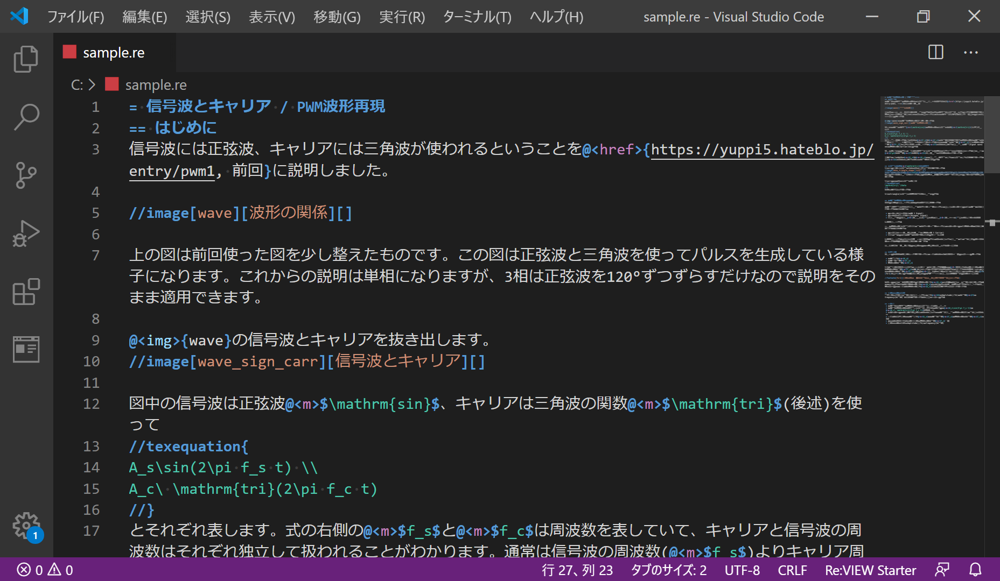
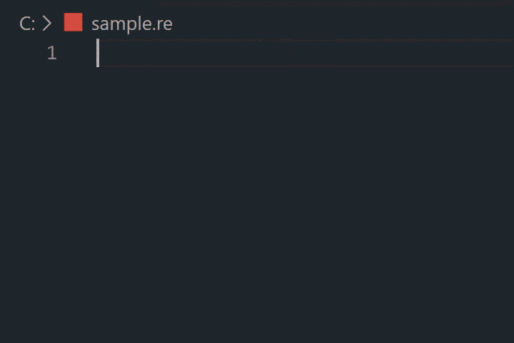
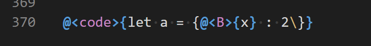

# Re:VIEW Starter Syntax Highlight
Re:VIEW Starter 用のシンタックスハイライト・コード補完の VSCode 拡張機能です。

## 特徴
### シンタックスハイライト
命令語に色が付きます。

### コード補完

Re:VIEW Starter の命令語を補完します。

### 入れ子が可能

Re:VIEW Starter の拡張であるインライン命令とブロック命令の入れ子に対応しています。
また、エスケープも有効です。

## 注意点
その他の Re:VIEW プロジェクトとは違い、プレビューウィンドウはありません。

## 既知の不具合
- ブロック命令の内側でリストが有効になっている

## バージョン履歴
### 1.0.3
- 対応バージョンの広範囲化 (1.25.1～)

### 1.0.2
- Marketplace の背景色を変更

### 1.0.0
- 最初のリリース

## その他のプロジェクト
- [Yet Another VSCode language Re:VIEW](https://github.com/erukiti/ya-language-review)
- [vscode-language-review](https://github.com/atsushieno/vscode-language-review)

